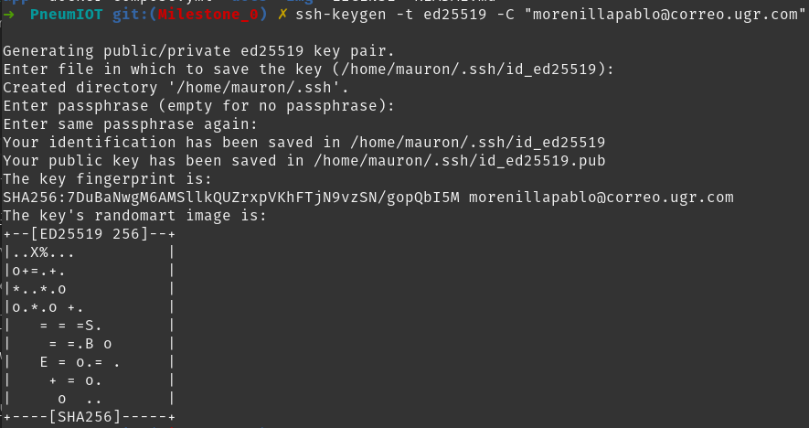
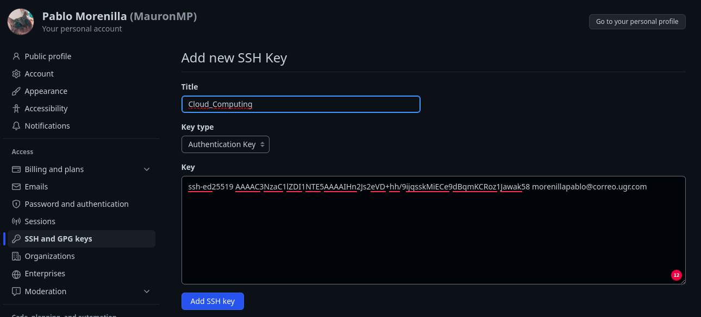
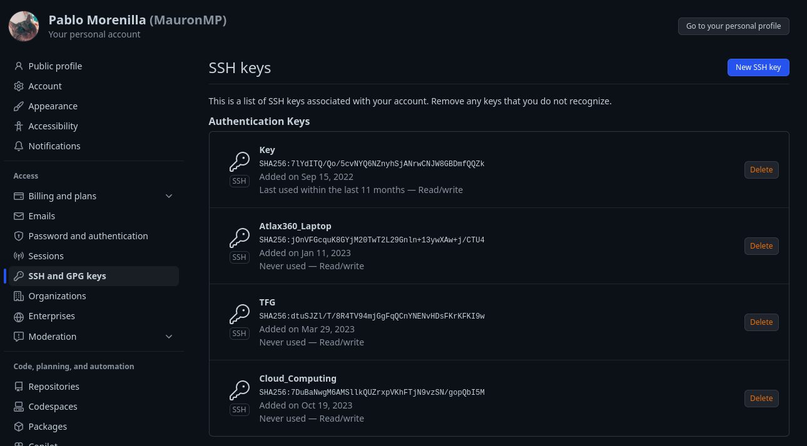
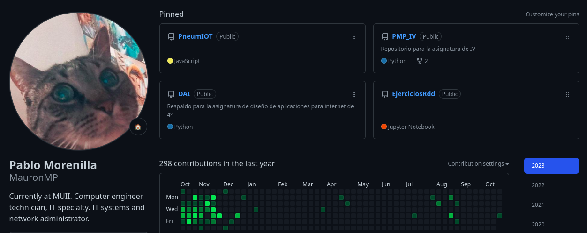
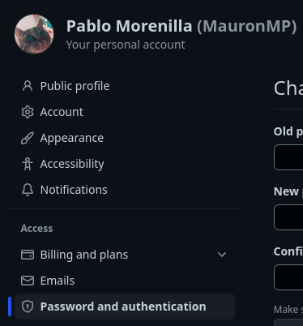
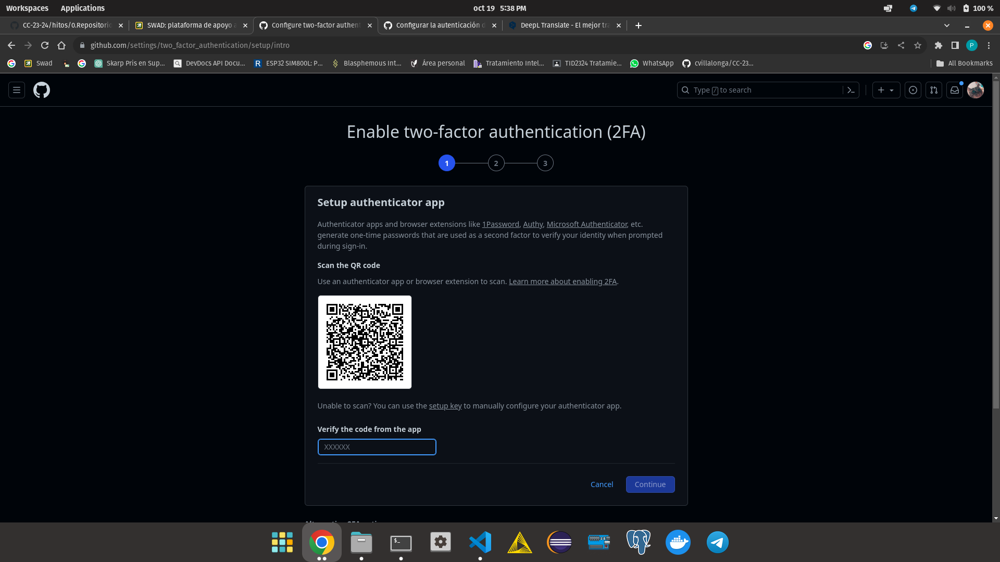
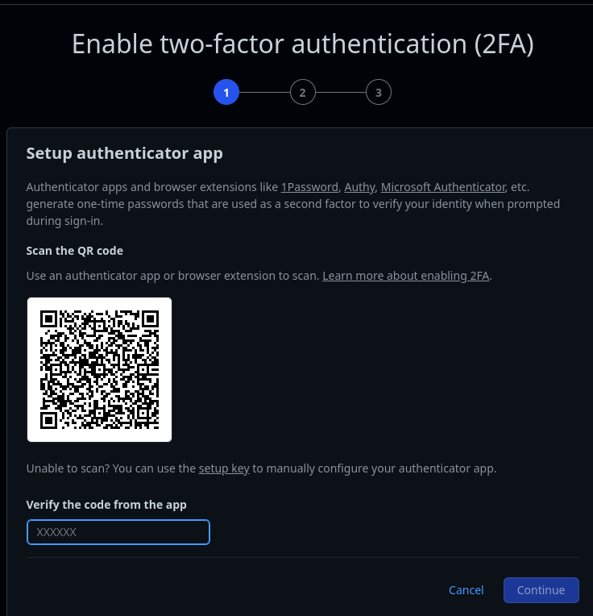

# Git and Github configuration

+ Key pair creation and public key upload to GitHub.

From the linux terminal we create the public and private keys for the repository, in this case, when creating them, I use the public key 
that I can see with the command cat ~/.ssh/id_ed25519, this key I add it in github and it is created.

+ Editing the GitHub profile to show an image instead of the default avatar, full name and city, as well as university.

+ Increasing the security of our GitHub account by activating the second authentication factor.

From github we access to the configuration of the created profile and enter the security section:

After that we go to the double authentication section, which will ask to scan a QR with an authenticator application, in my case with Google Authenticator.

