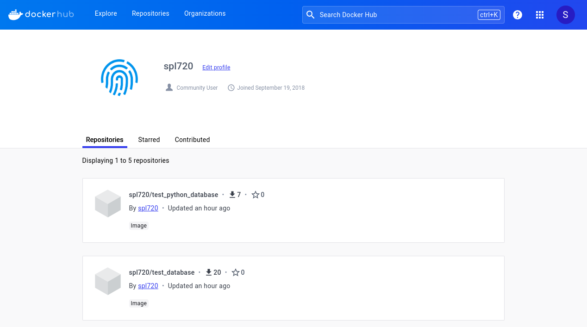
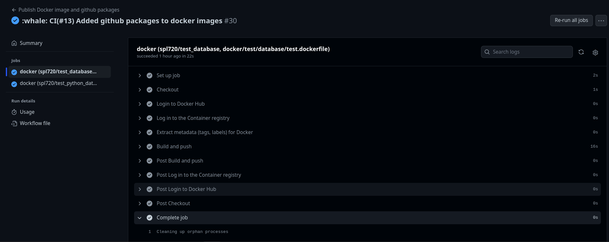
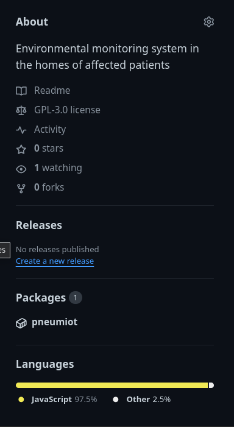
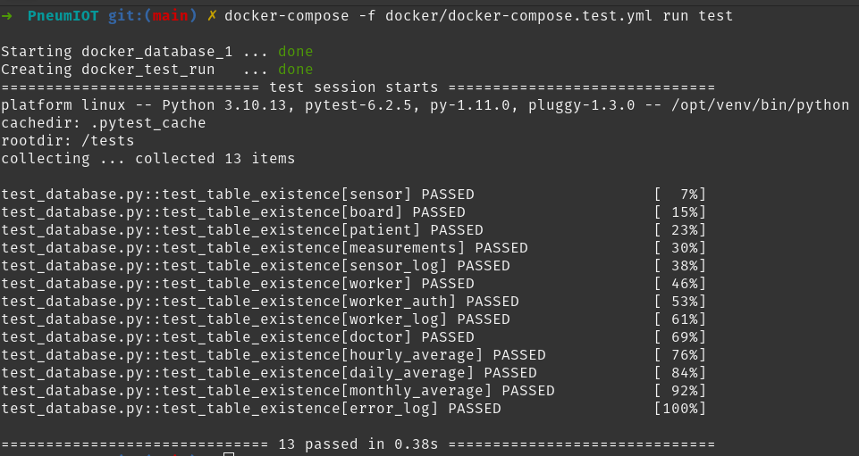

## Demonstration:

#### Database tests:
The tests created to test the database part of the database, use poetry, invoke and pytest.

#### Docker tests and docker-compose:
The created tests use two dockers, the first one is based on postgresql and the second one is based on python that connects with the first docker to make a verification test of the existence of the tables created in the database, for the communication docker compose is used as an orchestrator between both dockerfiles.

