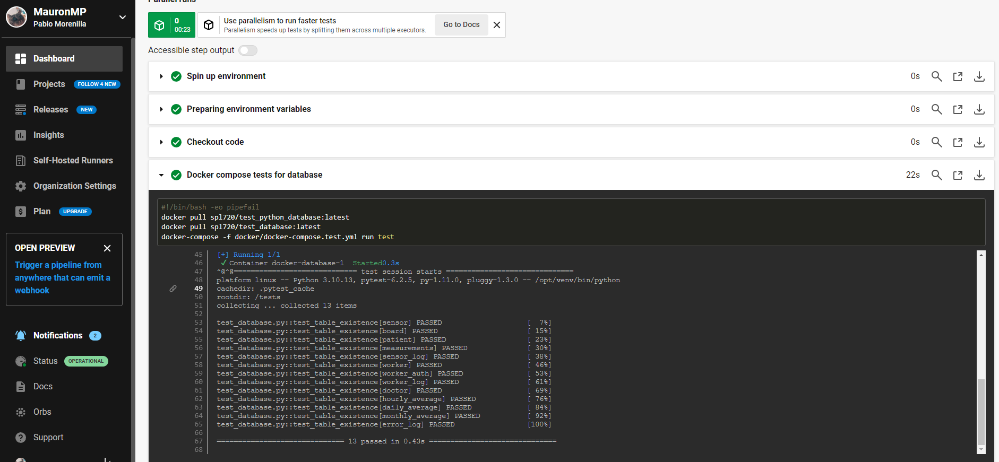

### CircleCI

1. **Seamless GitHub Integration:**
   - CircleCI seamlessly integrates with GitHub, simplifying setup and aligning with collaborative development workflows.

2. **Flexibility and Customization:**
   - Offers flexibility in configuring workflows, allowing for custom pipelines tailored to project requirements.

3. **Strong Docker Support:**
   - Robust support for Docker, enabling the effective utilization of containerization benefits in CI workflows.

4. **Scalability:**
   - Provides scalability for projects of varying sizes, efficiently handling both small and large-scale applications.

5. **User-Friendly Configuration:**
   - Expresses configuration in a simple YAML format, making it easy to understand and maintain for developers.

#### Configuration:

To use CircleCI, associate it with the project repository by creating a configuration file named `.circleci/config.yml`. This YAML file, similar to GitHub shares, should be placed in a separate directory named `.circleci`. The configuration specifies the use of Docker images and GitHub packages created within the project repository. In both cases, the configuration ensures image retrieval and runs tests using the Docker Compose configuration for testing, creating two distinct flows within the same pipeline.

Below is the configuration file and the circleci screenshots that show how the tests are executed on both sides and work correctly:


___


___
Here we can see that there is:

```
#!/bin/bash -eo pipefail
docker pull ghcr.io/mauronmp/pneumiot:main
docker-compose -f docker/docker-compose.test.yml run test  
```

Which makes references to github packages 
```
ghcr.io/mauronmp/pneumiot:main
```


___

On the other hand, we can see the pipeline for dockerhub:
```
#!/bin/bash -eo pipefail
docker pull spl720/test_python_database:latest
docker pull spl720/test_database:latest
docker-compose -f docker/docker-compose.test.yml run test   
```
