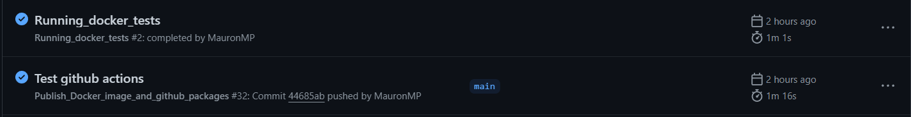

### Github Actions

For this section, a new file has been configured in the workflows directory of the repository. In this case, a new workflow is responsible for running after the workflow that creates and uploads Docker images has completed. Its purpose is to build Docker images on Dockerhub and execute tests using the [docker-compose](../../../docker/docker-compose.test.yml) file specifically designed for tests in the repository.

To ensure that the test workflow runs after the first one, the following syntax is used:

```
workflows: ["Publish_Docker_image_and_github_packages"]
    types:
      - completed
```

This specifies that once the workflow named "Publish_Docker_image_and_github_packages" completes, this workflow should be triggered.


Once the first workflow is triggered by making changes to the test files or Dockerfiles, both workflows will run simultaneously, as shown in the following image:



Examining the test execution workflow in more detail reveals successful execution, similar to how they were run in the [previous milestone locally.](../../Milestones/3_Docker/Demonstration_Docker.md)


