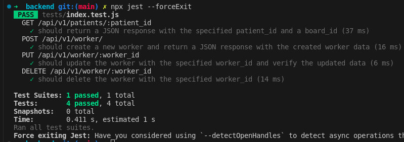
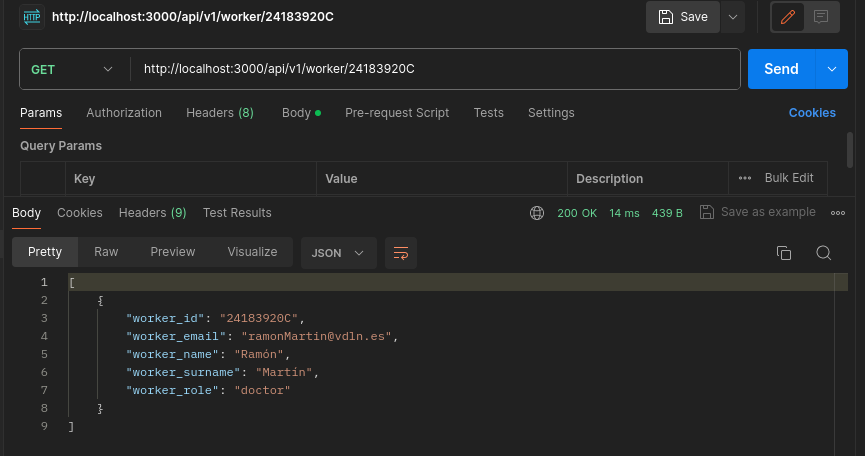

## Test Cases Description


### Tests code here below:

[Tests API](../../../app/backend/tests/index.test.js)

### Desmotration





### GET Endpoint to Retrieve Patient Data
- This test case verifies the functionality of the GET endpoint that retrieves patient data by patient_id.
- It checks whether the endpoint returns a JSON response with the specified patient_id and a board_id.
- The `expectedPatientId` and `expectedBoardId` are predefined values used for testing.
- It sends a GET request to the specified endpoint and expects a 200 status code and a JSON response.
- After receiving the response, it checks if the returned data contains the expected `patient_id` and `board_id`.

### POST Endpoint to Create a New Worker
- This test case verifies the functionality of the POST endpoint that creates a new worker.
- It sends a POST request with new worker data to the specified endpoint.
- Expects a 200 status code indicating success.
- Additional assertions can be added based on the response if necessary.

### PUT Endpoint to Update a Worker
- This test case verifies the functionality of the PUT endpoint that updates a worker by worker_id.
- It sends a PUT request with updated worker data to the specified endpoint.
- Expects a 200 status code indicating success.
- Verifies the success message returned in the response.
- Further verification can be performed by making a GET request to verify the updated data.

### DELETE Endpoint to Remove a Worker
- This test case verifies the functionality of the DELETE endpoint that removes a worker by worker_id.
- It sends a DELETE request to the specified endpoint.
- Expects a successful response without any content.

## Jest Configuration
```json
{
  "testEnvironment": "node",
  "transform": {
    "^.+\\.js$": "babel-jest"
  }
}
```