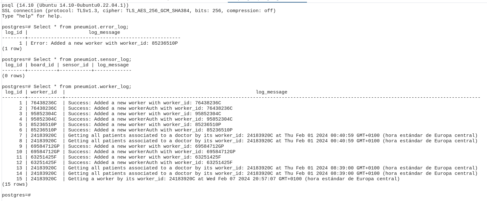

## Logs

The intention behind directly storing logs in the database is to enable efficient filtering and retrieval of specific types of logs. By storing logs directly in the database, it becomes easier to query and filter them based on various criteria such as timestamps, error types, or associated components.

This approach allows for more granular control over log data, facilitating tasks such as monitoring, debugging, and performance analysis. Instead of relying solely on log files or external logging services, having logs in the database enables seamless integration with existing data management systems and tools.

In the provided code, error log messages are directly inserted into the `error_log` table, ensuring that they are readily accessible for analysis and troubleshooting. By structuring logs in a database table, it becomes straightforward to execute SQL queries to retrieve specific logs based on defined criteria, providing valuable insights into system behavior and identifying potential issues efficiently.


Here's an explanation of how error logs of various types are stored directly in the database:

```javascript

/**
 * Returns all the boards in the database
 */
const getAllBoards = (req, res) => {
    pool.query(boardQueries.getAllBoards, (error, results) => {
        if (error) {
            const log_message = `Error getting all boards at ${new Date()}`;
            pool.query(logQueries.errorLog, [log_message], (error, results) => {});
        }
        ...
    });
};

/**
 * Returns all the boards associated with a worker by worker_id
 */
const getBoardsByWorkerId = (req, res) => {
    const worker_id = req.params.worker_id;
    pool.query(boardQueries.getBoardsByWorkerId, [worker_id], (error, results) => {
        if (error) {
            const log_message = `There was an error getting the boards by its worker_id: ${worker_id} at ${new Date()}`;
            pool.query(logQueries.errorLog, [log_message], (error, results) => {});
            ...
        }
        if (results.rows.length !== EMPTY_ARRAY) {
            const log_message = `Worker with worker_id: ${worker_id} got all boards at ${new Date()}`;
            pool.query(logQueries.workerLog, [worker_id, log_message], (error, results) => {});
            ...
        }
    });
};
```

In the provided code:

- Whenever an error occurs during the execution of database queries, an error log message is generated. For example:
  - In the `getAllBoards` function, if there's an error retrieving all boards, an error log message is created with the timestamp of the occurrence.
  - Similarly, in the `getBoardsByWorkerId` function, if there's an error retrieving boards associated with a worker, an error log message is created with the timestamp.
- These error log messages are then stored directly in the database using the `logQueries.errorLog` query, passing the error message and timestamp as parameters.
- Additionally, the database schema provided at the end of the code snippet includes the creation of the `error_log` table, which is where these error logs are stored. This table likely has columns for `log_id`, `log_message`, and perhaps a timestamp or other relevant information.


