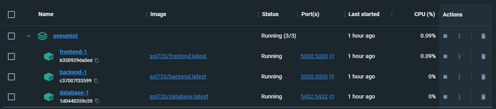

## Containers

### Node.js Backend Container:

- **Base Image:** node:14
- **Working Directory:** /app
- Copies `package.json` and `package-lock.json` files and installs dependencies using `npm install`.
- Copies the rest of the code into the container.
- Exposes port 3000, which is the port the Node.js server listens on.
- Runs the Node.js application using the command `node ./server.js`.

### PostgreSQL Database Container:

- **Base Image:** postgres:latest
- Copies SQL scripts (`init-db.sql` and `insert-data.sql`) to initialize and populate the database into the appropriate directory (`/docker-entrypoint-initdb.d/`). These scripts will be automatically executed when the container is started.

### Node.js Frontend Container:

- **Base Image:** node:14
- **Working Directory:** /app
- Similar to the backend container, it copies the `package.json` and `package-lock.json` files, installs dependencies, and copies the code into the container.
- Exposes port 5000, which is the port the frontend application listens on.
- Runs the frontend application using the command `npm start`.

## Docker hub and Docker Desktop

These containers encapsulate their respective components, making it easier to manage dependencies, ensure consistency across different environments, and deploy the application as a set of isolated units.

