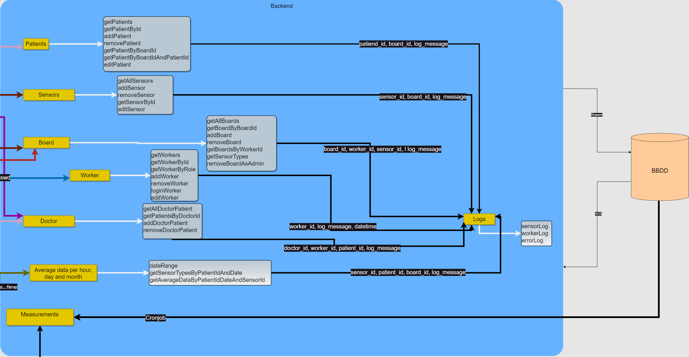
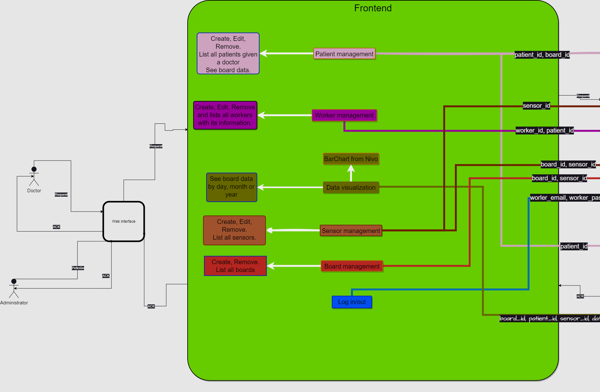
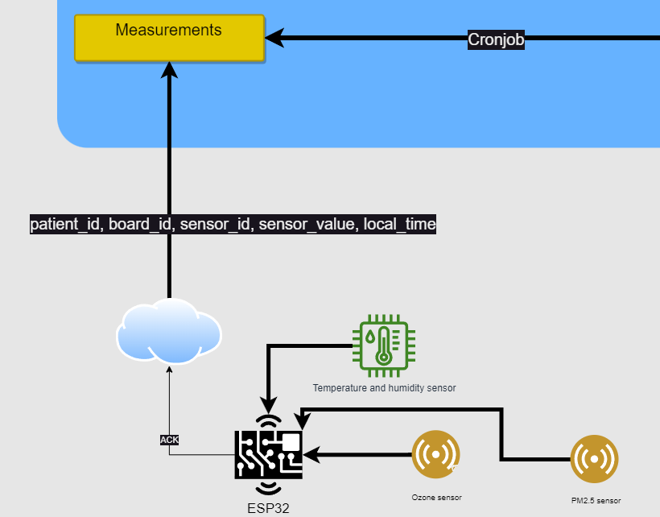
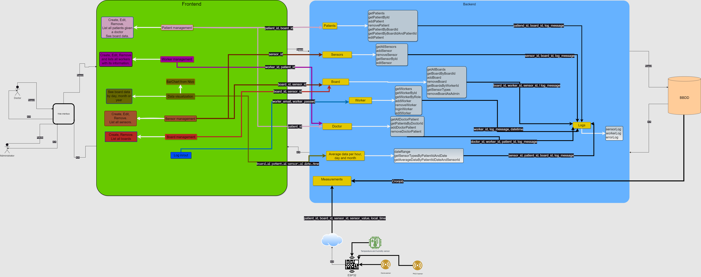

## Project Structure

### Backend (Node.js + Express)

The backend of the project is developed using Node.js and the Express framework. It handles HTTP requests, interacts with the PostgreSQL database, and manages the business logic of the application. The project structure may follow the MVC (Model-View-Controller) design pattern to efficiently organize the code.

### Frontend (React)

The frontend of the project is built with React, a JavaScript library for building interactive user interfaces. It uses reusable components to represent the user interface and consumes data from the backend through HTTP requests. The project structure may follow the common folder architecture in React applications, organizing components, styles, and static assets appropriately.

### Arduino (ESP32)

The Arduino device used in the project is an ESP32, which acts as part of the Internet of Things (IoT) system. It collects sensor data, sends it to the backend over a Wi-Fi connection, and receives instructions from the server. The Arduino project structure may include source code files, external libraries, and additional resources required for firmware implementation on the ESP32.

### Full diagram:

